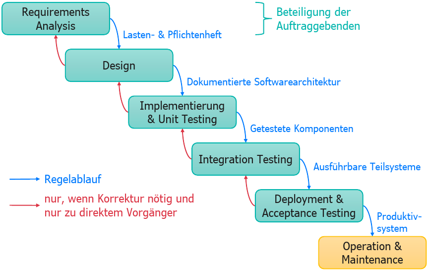

# Was ist das Wasserfallmodell?

Das **Wasserfallmodell** ist ein sequentielles (nicht iteratives) Vorgehensmodell in der Softwareentwicklung, bei dem der Projektfortschritt fließend und in Phasen abwärts durch die Aktivitäten der Anforderungserhebung, Konzeption, Implementierung, Testen, Deployment und Wartung verläuft. Jede Phase muss abgeschlossen sein, bevor die nächste beginnt, und es gibt typischerweise keine Rückkehr zu einer vorherigen Phase.

Bildquelle: Prof. Dr. Philipp Rohde, Foliensatz 23WiSe-SWT-AC

---

Lernziel 8 \[1/3\]: Wasserfallmodell erläutern, Vor- und Nachteile nennen können
