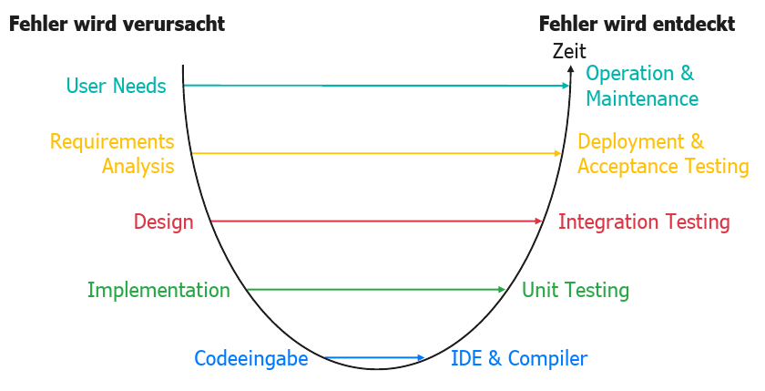

# Was ist der Zusammenhang zwischen den Phasen der Verursachung und Entdeckung von Softwarefehlern?

Bildquelle: Prof. Dr. Philipp Rohde, Foliensatz 23WiSe-SWT-AC

Der **Zusammenhang zwischen Verursachung und Entdeckung von Softwarefehlern** bezieht sich darauf, in welchen Phasen des Softwareentwicklungsprozesses Fehler eingeführt und identifiziert werden. Hierbei gilt generell:

- **Verursachung**: Fehler können in jeder Phase der Softwareentwicklung verursacht werden, beginnend bei der Anforderungsanalyse über das Design und die Implementierung bis hin zu Wartung und Updates. Häufige Ursachen sind Missverständnisse, Spezifikationsfehler, Designfehler, Programmierfehler, sowie Integrations- und Deployment-Fehler.

- **Entdeckung**: Fehler werden oft in einer späteren Phase als ihrer Verursachung entdeckt. Zum Beispiel können Designfehler während der Implementierung oder beim Testen auffallen, und Implementierungsfehler werden meistens in der Testphase oder sogar erst nach der Auslieferung in der Nutzungsphase gefunden.

Die Entdeckung von Fehlern folgt meist diesem Muster:

1. **Anforderungsphase**: Fehler in der Anforderungsspezifikation werden entweder während der Prüfung der Spezifikation oder in späteren Phasen der Entwicklung entdeckt.
2. **Designphase**: Designfehler werden häufig während der Designprüfungen oder während der Implementierung oder dem Testen der Software bemerkt.
3. **Implementierungsphase**: Programmierfehler werden oft während der Unit-Tests oder in späteren Testphasen wie Integrationstests oder Systemtests festgestellt.
4. **Testphase**: In dieser Phase werden die meisten Fehler entdeckt, da die Software intensiven Prüfungen unterzogen wird.
5. **Betriebs- und Wartungsphase**: Einige Fehler bleiben bis zur Betriebsphase unentdeckt und werden erst durch Benutzerberichte oder während der Wartungsarbeiten identifiziert.

Die **Kosten** für die Behebung von Fehlern steigen in der Regel mit dem Fortschreiten der Entwicklungsphasen, da die Komplexität und die Verflechtung des Codes zunehmen. Deshalb ist es sinnvoll, Fehler so früh wie möglich im Entwicklungsprozess zu entdecken und zu beheben. Methoden wie regelmäßige Code-Reviews, kontinuierliche Integration und automatisierte Tests können dabei helfen, Fehler frühzeitig zu erkennen und die Kosten für deren Behebung zu minimieren.

---

Lernziel 4 \[1/1\]: Zusammenhang der Phasen von Verursachung und Entdeckung von Softwarefehlern kennen
